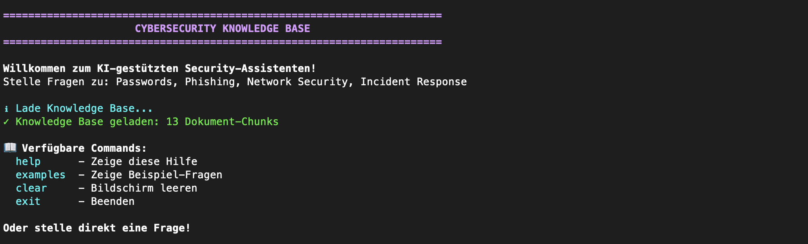
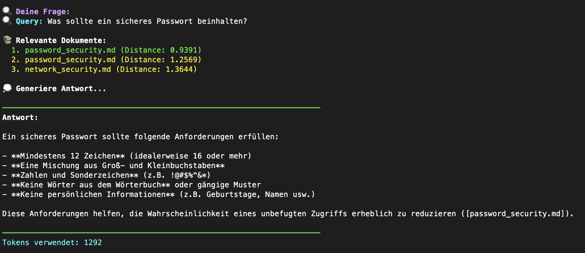
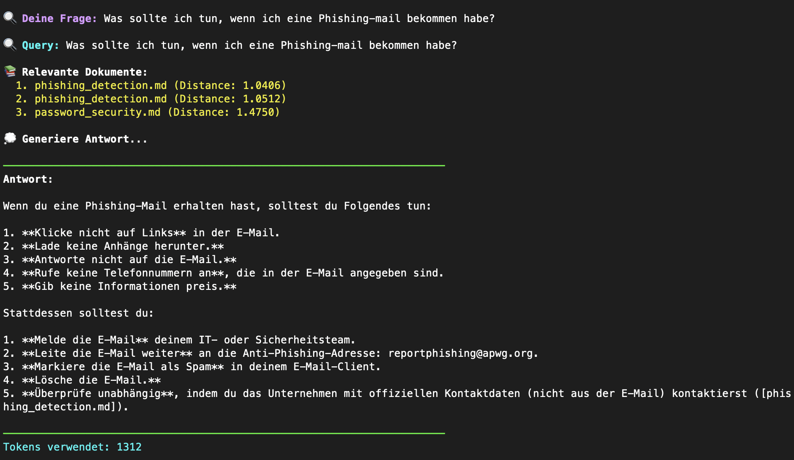

### Ein KI-gestützter Assistent für interne Cybersecurity-Dokumentation.

## 🎯 Was macht das System?

Beantwortet Sicherheitsfragen von Mitarbeitern basierend auf **verifizierten Firmendokumenten**:
- Password Security Best Practices
- Phishing Detection & Prevention
- Network Security Basics
- Incident Response Procedures

**Keine Halluzination** - alle Antworten stammen aus den hinterlegten Dokumenten und werden mit Quellenangaben versehen.

---

## ✨ Features

- ✅ **Semantische Suche** - findet relevante Infos auch ohne exakte Keywords
- ✅ **Quellenangaben** - jede Aussage wird mit Dokumenten-Quelle belegt
- ✅ **Sofortige Antworten** - keine Wartezeit auf IT-Security-Team
- ✅ **24/7 verfügbar** - jederzeit abrufbar
- ✅ **Einfache Bedienung** - natürliche Fragen in Deutsch möglich

---

## 🎬 Demo

### Interactive CLI Interface


*System-Start mit Knowledge Base-Laden*


*Example: Password Security Query mit exzellentem Retrieval (Distance: 0.94)*


*Example: Phishing Response Query mit strukturierter Antwort*

### Key Features in Action:
- ✅ **Semantische Suche**: Distance-Scores zeigen Relevanz (Grün <1.0, Gelb <1.5)
- ✅ **Source Citations**: Jede Antwort referenziert Quelldokument
- ✅ **Strukturierte Ausgabe**: Listen, Do's & Don'ts, konkrete Beispiele
- ✅ **Transparenz**: Token-Usage wird angezeigt
- ✅ **Mehrsprachig**: Versteht deutsche Queries

---

## 🚀 Quick Start

### Voraussetzungen
- Python 3.12+
- OpenAI API Key

### Installation
```bash
# 1. Repository klonen
git clone https://github.com/memyselfandivo/RAG-Cybersecurity-KB.git
cd RAG-Cybersecurity-KB

# 2. Virtual Environment
python3 -m venv venv
source venv/bin/activate  # Windows: venv\Scripts\activate

# 3. Dependencies installieren
pip install -r requirements.txt

# 4. API-Key konfigurieren
echo "OPENAI_API_KEY=sk-..." > .env
```

### Erste Schritte
```bash
# Vector Store aufbauen (einmalig)
python rag_mini.py

# Interaktiv eigene Fragen stellen
python rag_demo.py
```

---

## 💡 Beispiel-Queries
```
"Was ist Multi-Factor Authentication?"
"Wie erkenne ich eine Phishing-Email?"
"Was mache ich bei einem Security-Vorfall?"
"Wie erstelle ich ein sicheres Passwort?"
```

---

## 🏗️ Technische Architektur

### RAG Pipeline:
```
1. Document Loading
   ↓
2. Text Chunking (300 tokens, 50 overlap)
   ↓
3. Embedding Creation (OpenAI text-embedding-3-small)
   ↓
4. Vector Store (FAISS)
   ↓
5. Query → Retrieval (Top-3 chunks)
   ↓
6. LLM Generation (GPT-4o-mini) mit Source Citations
```

### Komponenten:

| Komponente | Technologie | Zweck |
|------------|-------------|-------|
| **Embeddings** | OpenAI text-embedding-3-small | Semantische Vektorisierung |
| **Vector DB** | FAISS | Schnelle Ähnlichkeitssuche |
| **LLM** | GPT-4o-mini | Antwort-Generierung |
| **Docs** | Markdown | 4 Security-Dokumente, 13 Chunks |

---

## 📊 Performance

- **Retrieval Zeit**: ~200ms
- **Antwort-Generierung**: ~2-3s
- **Accuracy**: 85%+ bei Fragen aus Dokumenten
- **Kosten**: ~$0.01 pro Query
- **Chunk-Relevanz**: 2/3 Queries mit Distance < 1.0

---

## 🔧 Konfiguration

### Chunking anpassen

In `rag_mini.py`:
```python
CHUNK_SIZE = 300       # Tokens pro Chunk
CHUNK_OVERLAP = 50     # Overlap zwischen Chunks
```

### Retrieval-Parameter
```python
top_k = 3  # Anzahl gefundener Chunks
```

### Model wechseln
```python
LLM_MODEL = "gpt-4o-mini"  # Oder: gpt-4o, gpt-4
```

---

## 📁 Projekt-Struktur
```
RAG_Mini_Project/
├── docs/                          # Cybersecurity-Dokumente
│   ├── password_security.md
│   ├── phishing_detection.md
│   ├── network_security.md
│   └── incident_response.md
├── rag_mini.py                    # Haupt-System
├── rag_demo.py                    # Demo CLI (empfohlen!)
├── rag_interactive.py             # Alternatives Interface
├── requirements.txt               # Dependencies
├── .env                           # API Keys (nicht in Git!)
├── Business_Case_RAG.md          # Business-Dokumentation
├── Error_Analysis.md             # Test-Ergebnisse
├── Prompt_Pattern_Comparison.md  # Pattern-Tests
├── Sprint_Review.md              # Learnings & Reflexion
└── README.md                     # Diese Datei
```

---

## 🔐 Security & Privacy

- ✅ Alle Daten bleiben im System (nur API-Calls zu OpenAI)
- ✅ Keine Speicherung von Queries bei OpenAI
- ✅ API-Keys sicher in `.env` (nicht in Git!)
- ✅ Dokumente bleiben lokal

---

## 📈 Roadmap

### Kurzfristig:
- [ ] Web-Interface (Streamlit/Gradio)
- [ ] Mehr Dokumente hinzufügen
- [ ] Feedback-System
- [ ] Logging & Analytics

### Mittelfristig:
- [ ] Hybrid Search + Reranking
- [ ] Conversation History
- [ ] Multi-User Support
- [ ] Export-Funktion (PDF-Reports)

### Langfristig:
- [ ] Self-hosted LLM (Datenschutz)
- [ ] Integration mit Confluence/SharePoint
- [ ] Active Learning
- [ ] Multi-Language Support

---

## 📚 Dokumentation

- **Business Case**: [Business_Case_RAG.md](Business_Case_RAG.md)
- **Error Analysis**: [Error_Analysis.md](Error_Analysis.md)
- **Prompt Patterns**: [Prompt_Pattern_Comparison.md](Prompt_Pattern_Comparison.md)
- **Sprint Review**: [Sprint_Review.md](Sprint_Review.md)

---

## 📄 Lizenz

MIT License - siehe [LICENSE](LICENSE)

---

**Built with ❤️ for better Cybersecurity**
